# Cloud-Native-Coverity-Deployment
Deployment examples for CNC onprem 

## Full CNC Reference Architecture

```mermaid
flowchart TB
    USERS["Engineers and reviewers<br/>Connect UI and REST APIs"]
    CI["CI/CD and developer workstations<br/>Thin Client or full Analysis client"]
    REGISTRY["Approved private registry<br/>Application, runner and dependency images"]

    subgraph CLUSTER["Kubernetes / OpenShift cluster"]
        direction TB

        EDGE["Gateway / Ingress / OpenShift Route<br/>Public HTTPS, DNS and certificate management"]

        subgraph APP["Application services"]
            direction LR
            CONNECT["Coverity Connect<br/>UI, APIs, findings and authentication"]
            HA["Optional Connect HA<br/>Additional web replicas"]
            COMMIT["Optional commit servers<br/>Dedicated commit processing"]
        end

        subgraph SCANS["Scan Services"]
            direction LR
            SCAN["Scan Service<br/>Job orchestration"]
            STORAGE["Storage Service<br/>Artifact access and signed URLs"]
            CACHE["Optional Cache Service<br/>Analysis caching"]
        end

        subgraph WORKERS["Dedicated analysis worker pools"]
            direction TB
            JOBS["Ephemeral analysis Jobs<br/>Job runner + selected analysis toolkit"]
            SCHEDULING["Node labels, taints and tolerations<br/>Resource sizing and node autoscaling"]
        end

        subgraph AI["Optional AI-Assisted Triage"]
            direction LR
            API["Suggestion API<br/>Authentication and request submission"]
            AIWORKERS["Worker deployments<br/>Triage processing"]
        end

        OPS["Supporting configuration and operations<br/>Secrets · CA trust · Service accounts · RBAC<br/>Setup and migration Jobs · Certificate generation<br/>Cleanup Jobs · CIM tools · Monitoring"]

        EDGE --> CONNECT
        EDGE -.-> HA
        EDGE -. "/ccd" .-> COMMIT

        CONNECT --> SCAN
        CONNECT --> STORAGE

        SCAN -- "Creates Kubernetes Jobs" --> JOBS
        SCHEDULING -. "Placement and capacity" .-> JOBS
        JOBS -- "Artifact access" --> STORAGE
        JOBS -. "Cache reuse" .-> CACHE
        JOBS -- "Commit results" --> CONNECT

        CONNECT -. "Triage requests" .-> API
        OPS -. "Configuration and lifecycle" .-> APP
        OPS -. "Configuration and lifecycle" .-> SCANS
    end

    subgraph DATA["Supporting data services — managed externally or deployed in-cluster where supported"]
        direction LR
        PG[("PostgreSQL<br/>Connect, scan and storage databases")]
        PGPOOL["Optional Pgpool<br/>Read traffic distribution"]
        REPLICAS[("Optional PostgreSQL<br/>Read replicas")]
        OBJECTS[("Object storage<br/>Scan artifacts and toolkits")]
        CACHEOBJECTS[("Separate cache bucket<br/>Cache lifecycle policy")]
        REDIS[("Redis<br/>Cache index")]
    end

    subgraph AIDATA["AI triage dependencies — separate configuration and lifecycle"]
        direction LR
        AIPG[("PostgreSQL<br/>Triage requests and results")]
        MQ["RabbitMQ<br/>Request queue"]
        AIOBJECTS[("Artifact storage<br/>Triage source context")]
        VAULT["Optional Vault integration<br/>Approved secrets management"]
    end

    LLM["Approved LLM endpoint<br/>Source context and finding analysis"]

    USERS -- "HTTPS" --> EDGE
    CI -- "HTTPS" --> EDGE
    CI -- "Signed artifact uploads" --> OBJECTS
    REGISTRY -. "Node image pulls" .-> CLUSTER

    CONNECT -- "Database TLS" --> PG
    SCAN -- "Database TLS" --> PG
    STORAGE -- "Database TLS" --> PG
    COMMIT -. "Writes" .-> PG
    HA -. "Optional read routing" .-> PGPOOL
    PGPOOL -.-> PG
    PGPOOL -.-> REPLICAS

    STORAGE --> OBJECTS
    JOBS -- "Artifact transfer" --> OBJECTS
    CACHE -.-> CACHEOBJECTS
    CACHE -.-> REDIS

    API --> MQ
    MQ --> AIWORKERS
    API --> AIPG
    AIWORKERS --> AIPG
    API --> AIOBJECTS
    AIWORKERS --> AIOBJECTS
    AIWORKERS -- "HTTPS" --> LLM
    VAULT -.-> API
    VAULT -.-> AIWORKERS

    classDef core fill:#e8f1ff,stroke:#2766a9,color:#223247,stroke-width:1.5px
    classDef scan fill:#eaf6ef,stroke:#2d8062,color:#223247,stroke-width:1.5px
    classDef data fill:#fff5df,stroke:#a27a30,color:#223247,stroke-width:1.5px
    classDef optional fill:#f4eefb,stroke:#8663b0,color:#223247,stroke-width:1.5px
    classDef external fill:#f0f3f7,stroke:#7890ac,color:#223247,stroke-width:1.5px

    class EDGE,CONNECT core
    class SCAN,STORAGE,JOBS,SCHEDULING scan
    class PG,REPLICAS,OBJECTS,CACHEOBJECTS,REDIS,AIPG,MQ,AIOBJECTS data
    class HA,COMMIT,CACHE,PGPOOL,API,AIWORKERS,VAULT optional
    class USERS,CI,REGISTRY,OPS,LLM external

    style CLUSTER fill:#f5f8fc,stroke:#96abc5,stroke-width:2px
    style APP fill:#ffffff,stroke:#b8c9dd
    style SCANS fill:#ffffff,stroke:#b8c9dd
    style WORKERS fill:#ffffff,stroke:#b8c9dd
    style AI fill:#faf6ff,stroke:#b8a0d0
    style DATA fill:#fffdf7,stroke:#d6c399
    style AIDATA fill:#faf6ff,stroke:#b8a0d0
```

**Scope:** Logical component relationships, not an exhaustive network-policy or TLS diagram. Optional components are not all required or compatible together. Supporting data services may run inside or outside the cluster.

**Connect-only:** Retain clients, edge routing, Connect, PostgreSQL, and supporting operations. Analysis runs on external full Analysis clients; Scan Services and their dependencies are omitted.

> **Coverity 2026.6 limitation:** AI-Assisted Triage is a beta feature and has a documented failure with multiple Connect replicas. Do not combine AI triage and Connect HA without a confirmed fix.

*Requires a Markdown renderer with Mermaid support, such as GitHub.*